# FACS-synthetic-classifier
Deep learning project to integrate facial expression into large language models.

## Introduction

This repository aims to experiment with and prototype **facial expression-aware** Large Language Models (LLMs).

LLMs are increasingly used in projects involving **direct user interaction**, typically through chatbots, and sometimes augmented with Automatic Speech Recognition (ASR), Text-to-Speech (TTS), and audio-to-video models.

However, these underlying models often **lack access to crucial user inputs** such as voice and facial expressions, leaving them unaware of important aspects of user input [[16](#16)].
Similar closely related questions also arise in the field of Human-Robot Interaction (HRI) [[19](#19)].

Additionally, these inputs contain key information that could enable the LLM to handle **interruptions**, **be interrupted**, or **detect turn-taking signals** [[14](#14)].
Furthermore, if the modeled agent needs to express emotion, while maintaining low-latency, it could be very useful to directly implement some sort of TTS and emotion directly as outputs of the model.

The main goal of this repository is to experiment with the specific challenge of making an LLM both **aware of facial expressions** as input and capable of **facial expressiveness** as output.

The very first step in this experimentation is to find a way to represent and **tokenize facial expressions**. \
The second step is to develop a method to automatically and reliably **extract** this information from real-world data. \
The final step is to **integrate** this additional data into an LLM.

More precisely, this repository aims to leverage Metahumans and their **Facial Action Coding System** (**FACS**) based rig to generate a synthetic dataset of diverse facial expressions across various avatars to train a model to recognize them. \
Prior works [[1](#1), [8](#8)] leveraged real-world datasets annotated by expert coders. \
More recent work [[22](#22)] proposed augmenting real-world data with synthetic data by retargeting existing datasets onto 3D models. \
Inspired by [[17](#17), [18](#18)], we aim to rely completely on synthetic data, leveraging rig data to obtain continuous and highly accurate measurements of facial states.

### Related works

Facial expressions have been widely studied in the context of deep learning, one of its application is sentiment analysis based on facial expression estimation [[1](#1), [8](#8)].

**TO DO: add more references to Facial Action Unit Detection**.

A significant distinction exists between **posed facial expressions**, which are more exaggerated and easier to detect, and **spontaneous facial expressions** (associated with real data), which are subtler and more difficult to detect.

Facial expressions have also been studied in the context of **transfer**, which involves moving expressions from an actor in a source video to another actor in a target video [[15](#15)].
This is closely related to the challenge of achieving **expressiveness**.

Furthermore, we reference two different papers on **3D face reconstruction**:

- [[17](#17), [18](#18)] discuss **leveraging synthetic data** to estimate dense **landmark localization** and **face part parsing**.
These papers demonstrate the effectiveness of synthetic data in face-related computer vision tasks.

- [[7](#7)] describes a method of training a CNN for video-based facial performance capture tailored to one specific actor, using 5-10 minutes of captured footage.
While this method is actor-specific, it is **highly accurate** and **industry-oriented**.

Finally, the FAtiMA Toolkit [[9](#9)] enables the development of socio-emotional agents capable of interpreting and generating emotionally aware responses, enhancing interactions in application

### Representation of facial expression

A natural question is whether there exists an **interpretable representation space** that bridges the gap between the visual space of images and the discrete space of emotions.

Following priori works [[1](#1), [3](#3), [8](#8), [20](#20)], we utilize the **Facial Action Coding System** (**FACS**) [[4](#4), [5](#5), [6](#6)] to deconstruct facial expressions into interpretable sub-element calls "**action units**" (**AU**).
These **AU**s are related to muscle activity.

|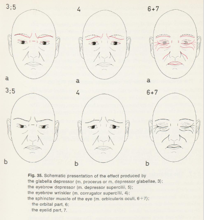|
|:--:| 
| **Fig. 1.** Illustration of muscles activity from [[6](#6)] |

Examples of such **AU**s include:
| Action units | **FACS** name |
| -------- | ------- |
| **AU6** | Cheek raiser |
| **AU12** | Lip corner puller |

From this, an expression of happiness could be identified by the combination of **AU6** + **AU12**.

This system also includes an intensity scoring ranging from A (trace) to E (maximum).

The **FACS** system is valued for its interpretability and the reproducibility of its codings by trained experts. Research such as [[1](#1)] demonstrates its effectiveness in evaluating emotion beyond **discrete** emotion classification using the **arousal-valence model** [[13](#13)].
Authors in [[3](#3)] contrasts the limitations of self-reporting emotions with studies focusing solely on **AUs**.
Study [[8](#8)] explores emotion detection using a **graph-based approach**, and [[20](#20)] illustrates how **AUs** can be utilized to detect both **micro** and **macro expressions** in video content.

### Datasets

Several high-quality datasets, annotated by **FACS** expert coders, are available [[10](#10), [11](#11), [21](#21)].
These datasets provide a robust foundation for testing our models.

Recent work [[22](#22)] proposed augmenting these real-world datasets by generating synthetic data through retargeting existing data onto 3D models.

As shown in [[17](#17), [18](#18)], synthetic data can also be sufficiently effective for face-related tasks in computer vision.
We plan to leverage game engine (namely Unreal Engine), which offers **realistic rendering**, **controllability**, and access to pre-designed characters, to generate such synthetic datasets.
Our hope is that the high **controllability** and **reliability** of synthetic data could help us improve the performance of facial expressions recognition.

### MetaHuman

One option for creating realistic avatar is the MetaHuman creator.
This tool, fully integrated with Unreal Engine, allows an easy design of characters.

Two important questions arise: Do we have full control over facial expressions? And, is the tool versatile enough to create a diverse set of characters to train a CNN on ?

The first question concerns the control of facial expressions.
According to [[13]](#13) the facial rig of MetaHuman is designed with the **FACS** system in mind, making it highly suitable for our purposes.

|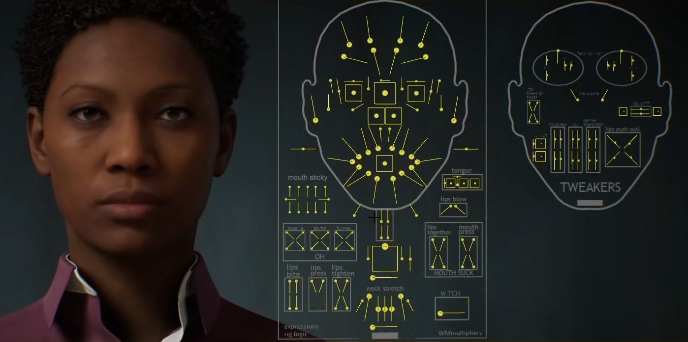|
|:--:| 
| **Fig. 2.** Rig controllers of MetaHuman |

The second question addresses diversity. The tool offers 66 presets of various characters, along with an option to blend them, which potentially allows for significant augmentation of the MetaHuman set.

If we observe some issue with generalization of the trained model, we could leverage **Mesh to MetaHuman** with some **3D morphable face models** following [[2](#2), [18](#18)] trained from a diverse set of **3D scans**.

### Steps of experimentation

First we aim to generate a dataset where, starting with a MetaHuman, we render it in multiple facial expressions, with some form of augmentation following [[18](#18)].

Then, given this recipe, we use it to generate multiple renders of different MetaHuman.
For this purpose, we have to scrape the MetaHuman Creator tool to expand our character set.

Following [[17](#17)], we train a CNN (namely a ResNet). This network will take as input the **3D renders** of our MetaHuman set and output the values of the **controller rig** (scalar values).
The use of **Gaussian negative log likelihood** (**GNLL**) is recommended by authors of [[17](#17)] to manage the uncertainty of measurements.
Even if our initial dataset will not feature occluded parts, **GNLL** seems to be an interesting way to manage the varying sensitivities of rig controllers.

Subsequently, we can test the model using **real world data** from the [datasets section](#datasets).
If the results are *acceptable* (human evaluation), we could try to apply more conventional machine learning techniques to classify **AUs** based on rig controllers data.

Assuming these experiments are successful, we plan to experiment with the integration of these data in LLM.
First, we could try to leverage few-show abilities of LLMs (with integration of **AU**).
Then try to finetune an LLM by adding some face-expression encoding (with integration of **AU** or **rig data**) to the token (**time-**)associated, making it **face-expression aware**, and also train a second LM head to predict **face-expression** associated to the next token.

|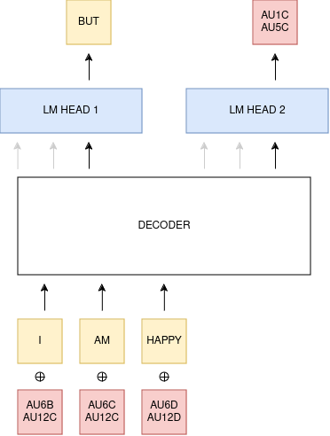|
|:--:| 
| **Fig. 3.** Description of a LLM face-aware pipeline. |

Since this phase heavily depends on the success of prior parts, we will not extensively detail it at this stage.

## Implementation

In this section, we give more technical details regarding this repository.

The primary goal of this section is to reproduce the describe steps in the previous [subsection](#steps-of-experimentation).

### Synthetic data generation

To take control of the Unreal Engine editor (5.4), we use [Unreal Engine python API](https://docs.unrealengine.com/5.4/en-US/PythonAPI/).
Inspired by ideas from [[18](#18)], we implement three types of augmentation :
- **Light augmentation:** Modifying light distance, angles, and color, see [figure 4.b](#figure_data_gen).
- **Camera augmentation**: Adjusting variable angles and focal distances, see [figure 4.c](#figure_data_gen).
- **Background variation:** : Implementing randomly generated backgrounds, see[figure 4.d](#figure_data_gen).

Additionally, we generate facial expressions, by leveraging rig controllers.
To generate a facial expression:
- Drawing uniformly a number $X_1$ (up to a certain constant N) to decide the number of rig controllers to adjust.
- Drawing $X_1$ rig controllers without replacement.
- For each selected controller, uniformly determining its new value.

We then create a sequence of facial expressions by doing linear interpolations between each expression, see [figure 4.a](#figure_data_gen).

||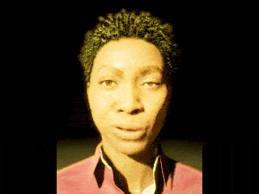|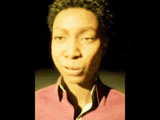|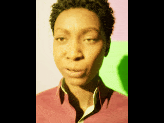|
|:--:|:--:|:--:|:--:|
|**Fig. 4.a.** Sequence of facial expressions|**Fig. 4.b.** Light augmentation|**Fig. 4.c.** Camera augmentation|**Fig. 4.d.** Background variation|

### Scrapping MetaHuman Creator

To scrape MetaHuman Creator, we need to create an interface between the website and python.
Given that the website streams video from a remote computer hosting the software, we use [PyAutoGUI](https://pyautogui.readthedocs.io/en/latest/) and [OpenCV](https://docs.opencv.org/4.x/index.html) to navigate through it.

As mentionned in a [previous section](#metahuman), our goal is to maximize the **diversity** of MetaHumans as diverse possible using features from the MetaHuman Creator. One crucial feature is the blending function, illustrated below.

|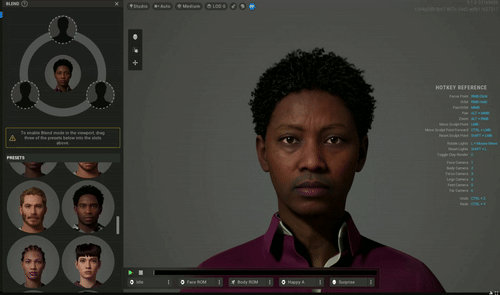|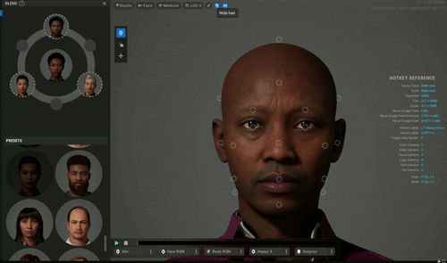|
|:--:| :--:| 
|**Fig. 5.a.** Randomly choose MetaHumans before blending | **Fig. 5.b.** Blending of MetaHumans |

Additionally, the bot select randomly other fixed features such as eyes, mustaches, beards, and hairstyles.

Finally we obtain an extended set of MetaHumans using the 66 base models provided in the tool.
We compare this generated set with the set presented in [[18](#18)] in [figure 5](#mh_panorama) below.

|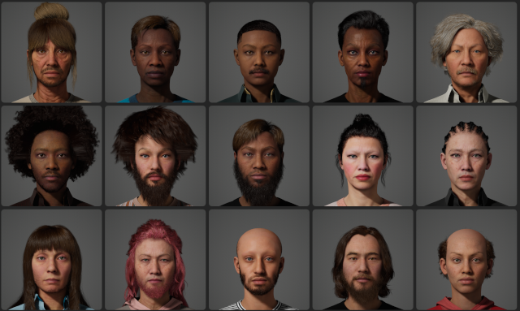|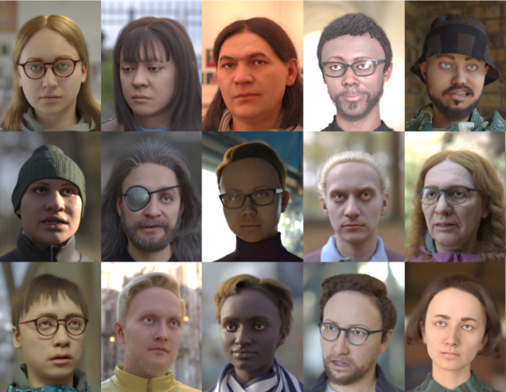|
|:--:|:--:|
| **Fig. 6.a.** Panorama of generated MetaHumans | **Fig. 6.b.** Panorama from [[18](#18)] |

If we observe some issues with the generalization of the trained model, we could also leverage **Mesh to MetaHuman** as explained in [this previous section](#metahuman) to further increase diversity.

### Training a model (WIP)

Now that we have a dataset of **3D renders** paired with **Rig controller states**, our next step is to train a CNN on it.

Following [[17](#17)], we consider ResNet 101.
This model is trained to predict each controller rig value, but also the uncertainty of its predictions (see [figure](#training) below).

|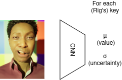|
|:--:|
| **Fig. 5.** Given an image we predict controller rig value and its uncertainty ||

During training, we apply the **GNLL** loss to handle the uncertainty of predictions.

**TO DO: ADD LEARNING CURVE + VALIDATION**.

## Results (WIP)

### FACS classifier

In this subsection we show results of the model applied to [real data](#datasets).

### FACS augmented LLM

#### In-context learning

In this subsection we prompt an LLM with **AUs** descriptions, and ask it to generate answers augmented with **AUs**.

**TO DO: CONNECTION WITH [[9](#9)]**.

#### Fine-tuned LLM

In this subsection we fine-tune an LLM by adding some **face-expression encoding** to the (**time-**)associated token, making it **face-expression aware**.
Additionally, we train a second LM head to predict the **face-expression** of the next token.

## References

[<a id="1">1</a>]
Al-Darraji, S.,
Berns, K.,
Rodić, A.:
Action Unit Based Facial Expression Recognition Using Deep Learning.
In International Conference on Robotics in Alpe-Adria Danube Region, 2017.
[(link)](https://www.researchgate.net/publication/311098799_Action_Unit_Based_Facial_Expression_Recognition_Using_Deep_Learning)

[<a id="2">2</a>]
Blanz, V.,
Vetter, T.:
A Morphable Model For The Synthesis Of 3D Faces.
In SIGGRAPH, 1999.
[(pdf)](https://www.face-rec.org/algorithms/3D_Morph/morphmod2.pdf)

[<a id="3">3</a>]
Davison, A. K.,
Merghani, W.,
Yap, M. H.:
Objective Classes for Micro-Facial Expression Recognition.
In J. Imaging, 2018.
[(link)](https://www.mdpi.com/2313-433X/4/10/119)

[<a id="4">4</a>]
Ekman, P.,
Friesen, W. V.:
Facial Action Coding System (FACS).

[<a id="5">5</a>]
Ekman, P.:
Facial expression and emotion.
In American Psychologist, 1993.

[<a id="6">6</a>] 
Hjortsjö, C.-H.:
Man's face and mimic language.
Lund: Studentlitteratur, 1970
[(pdf)](https://web.archive.org/web/20211111212349/https://diglib.uibk.ac.at/download/pdf/782346)

[<a id="7">7</a>]
Laine, S.,
Karras, T.,
Aila, T.:
Production-Level Facial Performance Capture Using Deep Convolutional Neural Networks.
In Symposium on Computer Animation, 2017.
[(pdf)](https://research.nvidia.com/sites/default/files/publications/laine2017sca_paper_0.pdf)

[<a id="8">8</a>]
Luo, C.,
Song, S.,
Xie, W.,
Shen, L.,
Gunes, H.:
Learning Multi-dimensional Edge Feature-based AU Relation Graph for Facial Action Unit Recognition.
In Proceedings of the Thirty-First International Joint Conference on Artificial Intelligence, 2022.
[(link)](https://www.ijcai.org/proceedings/2022/0173.pdf)

[<a id="9">9</a>]
Mascarenhas, S.,
Guimarães, M.,
Prada, R.,
Santos, P. A.,
Dias, J.,
Paiva, A.:
FAtiMA Toolkit: Toward an Accessible Tool for the
Development of Socio-emotional Agents.
In ACM Transactions on Interactive Intelligent Systems, 2022.
[(pdf)](https://dl.acm.org/doi/pdf/10.1145/3510822)

[<a id="10">10</a>]
Mavadati, M.,
Sanger, P.,
Mahoor, M. H.:
Extended DISFA Dataset: Investigating Posed and Spontaneous Facial Expressions.
In IEEE Conference on Computer Vision and Pattern Recognition Workshops, 2016.
[(pdf)](https://openaccess.thecvf.com/content_cvpr_2016_workshops/w28/papers/Mavadati_Extended_DISFA_Dataset_CVPR_2016_paper.pdf)

[<a id="11">11</a>]
Qu, F.,
Yan, W.-J.,
Fu, X.,:
CAS(ME)2): A Database for Spontaneous Macro-Expression and Micro-Expression Spotting and Recognition.
In IEEE Transactions on Affective Computing, 2017.
[(link)](https://www.researchgate.net/publication/312506312_CASME2_A_Database_for_Spontaneous_Macro-Expression_and_Micro-Expression_Spotting_and_Recognition)

[<a id="12">12</a>]
Russel, J. A.,
Mehrabian, A.:
Evidence for a Three-Factor Theory of Emotions.
In Journal of Research in Personality, 1977.
[(link)](https://www.researchgate.net/publication/222741832_Evidence_for_a_Three-Factor_Theory_of_Emotions)

[<a id="13">13</a>]
Rig Logic: runtime evaluation of MetaHuman face rigs.
[(pdf)](https://cdn2.unrealengine.com/rig-logic-whitepaper-v2-5c9f23f7e210.pdf)

[<a id="14">14</a>]
Skantze, G.:
Turn-taking in Conversational Systems and Human-Robot Interaction: A Review.
In Computer Speech & Language, 2021.
[(link)](https://www.sciencedirect.com/science/article/pii/S088523082030111X)

[<a id="15">15</a>]
Thies, J.,
Zollhöfer, M.,
Nießner, M.,
Valgaerts, L.,
Stamminger, M.,
Theobalt, C.:
Real-time Expression Transfer for Facial Reenactment.
In ACM Transactions on Graphics, 2015.
[(pdf)](https://graphics.stanford.edu/~niessner/papers/2015/10face/thies2015realtime.pdf)

[<a id="16">16</a>]
Tracy, J. L.,
Randles, D.,
Steckler C. M.:
The nonverbal communication of emotions.
In Current Opinion in Behavioral Sciences, 2015.
[(link)](https://www.sciencedirect.com/science/article/abs/pii/S235215461500011X)

[<a id="17">17</a>]
Wood, E.,
Baltrušaitis, T.,
Hewitt, C.,
Johnson, M.,
Shen, J.,
Milosavljević, N.,
Wilde, D.,
Garbin, S.,
Sharp, T.,
Stojiljković, I.,
Cashman, T.,
Valentin, J.:
3D Face Reconstruction with Dense Landmarks.
In ECCV, 2022.
[(pdf)](https://arxiv.org/pdf/2204.02776)

[<a id="18">18</a>]
Wood, E.,
Baltrušaitis, T.,
Hewitt, C.,
Dziadzio, S.,
Cashman, T. J.,
Shotton, J.:
Fake it till you make it: Face analysis in the wild using Synthetic Data alone.
In IEEE/CVF, 2021.
[(pdf)](https://openaccess.thecvf.com/content/ICCV2021/papers/Wood_Fake_It_Till_You_Make_It_Face_Analysis_in_the_ICCV_2021_paper.pdf)

[<a id="19">19</a>] 
Yan, F.,
Iliyasu, A. M.,
Hirota, K.:
Emotion space modelling for social robots
In Engineering Applications of Artificial Intelligence, 2021.
[(link)](https://www.sciencedirect.com/science/article/abs/pii/S0952197621000257)

[<a id="20">20</a>]
Yang, B.,
Wu, J.,
Zhou, Zhiguang,
Komiya, Megumi:
Facial Action Unit-based Deep Learning Framework for Spotting Macro-and Micro-expressions in Long Video Sequences.
In ACM Multimedia, 2021.
[(link)](https://www.researchgate.net/publication/353890502_Facial_Action_Unit-based_Deep_Learning_Framework_for_Spotting_Macro-and_Micro-expressions_in_Long_Video_Sequences)

[<a id="21">21</a>]
Zhang, X.,
Yin, L.,
Jeffrey, F. C.,
Canavan, S.,
Reale, M.,
Horowitz, A.,
Liu, P.,
Girard, J. M.:
BP4D-Spontaneous: A high-resolution spontaneous 3D dynamic facial expression database.
In Image and Vision Computing, 2014
[(link)](https://www.researchgate.net/publication/264348304_BP4D-Spontaneous_A_high-resolution_spontaneous_3D_dynamic_facial_expression_database)

[<a id="22">22</a>]
Lu, L.,
Yin, Y.,
Gu,Y.,
Wu, Y.,
Prasad, P.,
Zhao, Y.,
Soleymani, M.:
Leveraging Synthetic Data for Generalizable and
Fair Facial Action Unit Detection
[(pdf)](https://arxiv.org/pdf/2403.10737)
